# Factorio Calculator - Completed Tests (Evidence)

---

## Test Case 1: CLI - Happy Path (Green Belt, Verbose)

**Status:** ✅ PASS 

**Description:**
Test the CLI with default green belt and verbose output enabled.

**Configuration Used:**
```json
{
   "belt_color": "green",
   "product": "electronic_circuit",
   "verbose": "true",
   "consoleLogging": "false"
}
```

**Screenshots:**
- Console Output:
  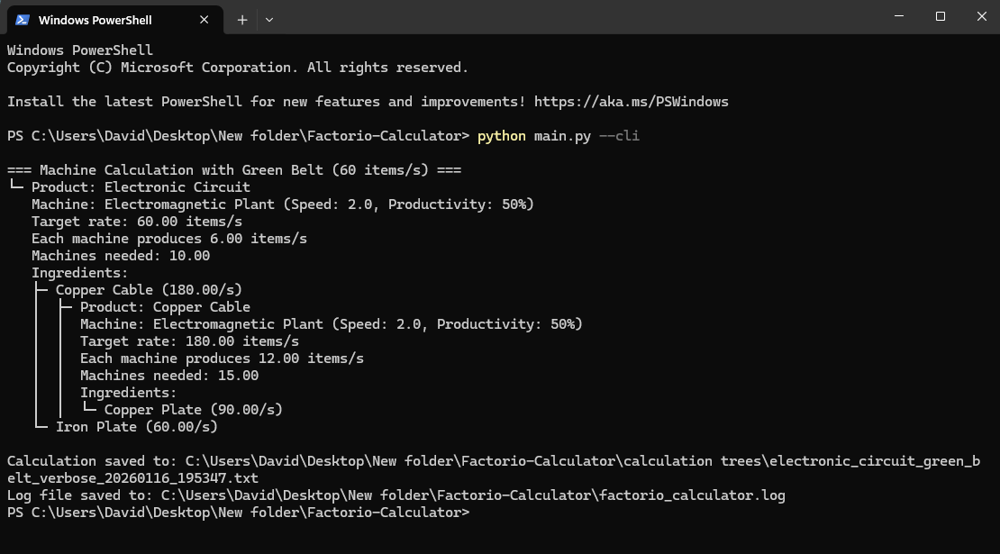
- Output File in calculation trees/:
  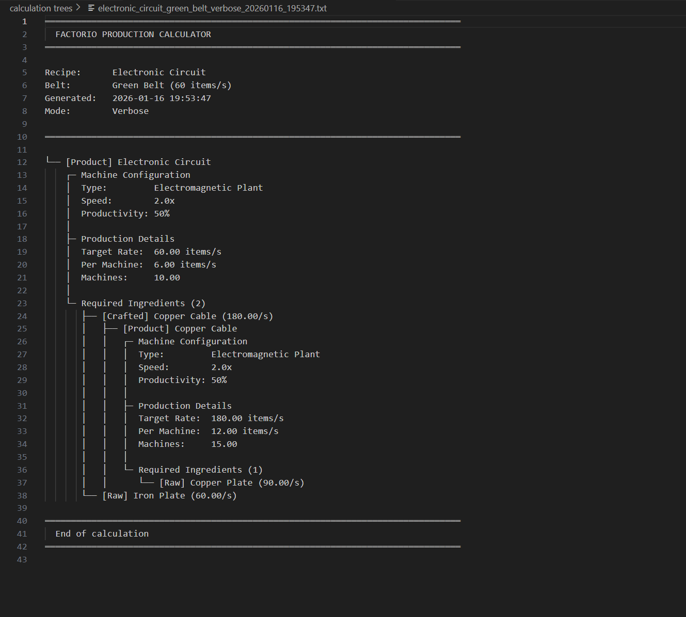
- Log File Verification:
  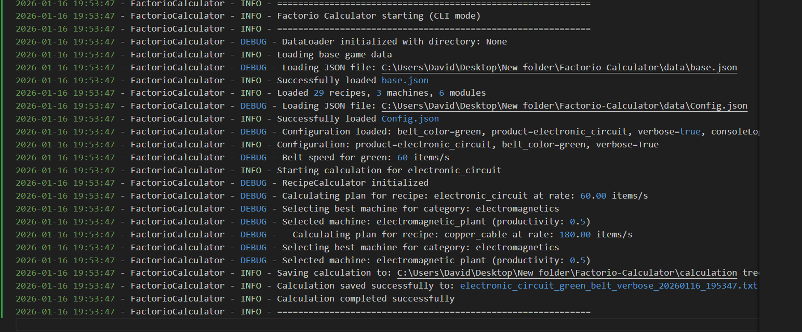

**Observations:**
- Belt speed displayed: 60/s 
- Console shows verbose machine details
- Output file created with current timestamp 
- Log file created at project root
- No exceptions or errors

---

## Test Case 2: CLI - Different Belt (Yellow, Compact)

**Status:** ✅ PASS

**Description:**
Test the CLI with yellow belt and compact (non-verbose) output.

**Configuration Used:**
```json
{
   "belt_color": "yellow",
   "product": "electronic_circuit",
   "verbose": "false",
   "consoleLogging": "false"
}
```

**Screenshots:**
- Console Output (should be compact):
  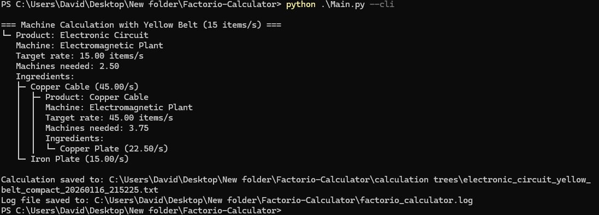
- Output File with yellow_belt in filename:
  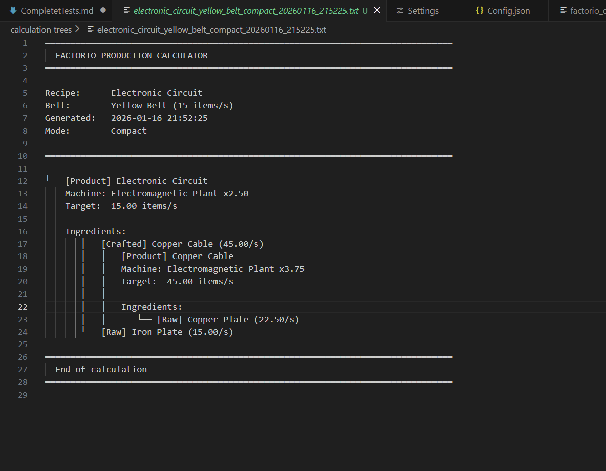

**Observations:**
- Belt speed displayed: 15/s
- Compact output (no machine speed/productivity lines)
- Machine count adjusted for slower belt speed
- Filename includes `yellow_belt`
- No verbose info appears

---

## Test Case 3: CLI - Invalid Recipe Error Path

**Status:** ✅ PASS 

**Description:**
Test error handling when an invalid/non-existent recipe is specified.

**Configuration Used:**
```json
{
   "belt_color": "green",
   "product": "nonexistent_recipe_xyz",
   "verbose": "true",
   "consoleLogging": "false"
}
```

**Screenshots:**
- Console Error Message:
  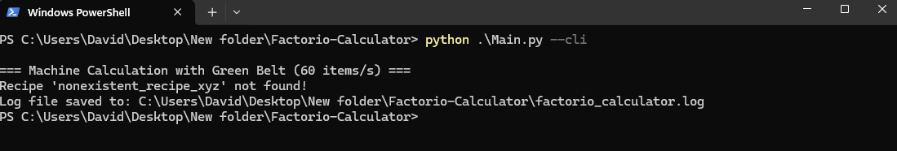
- Log File showing error entry:
  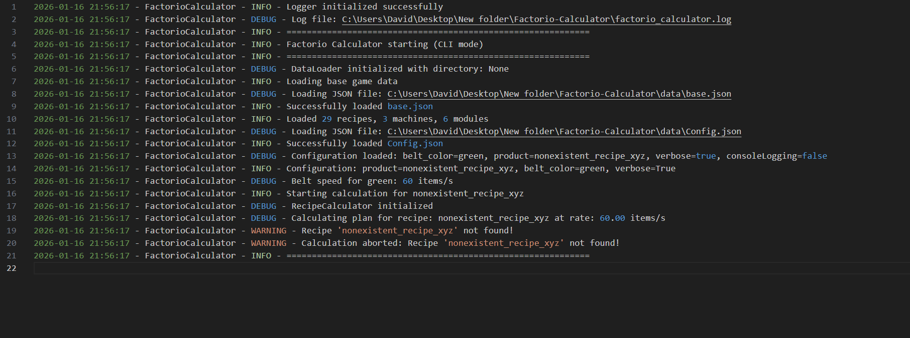

**Observations:**
- Error message displayed: "Recipe 'nonexistent_recipe_xyz' not found!"
- No calculation tree file created
- Program exits gracefully (no crash)
- Error logged in log file


---

## Test Case 3.5: CLI - Invalid Belt Error Path

**Status:** ✅ PASS

**Description:**
Test error handling when an invalid belt color is specified.

**Configuration Used:**
```json
{
   "belt_color": "pink",
   "product": "electric_engine_unit",
   "verbose": "true",
   "consoleLogging": "false"
}
```

**Screenshots:**
- Console Error Message:
  
- Log File showing error entry:
  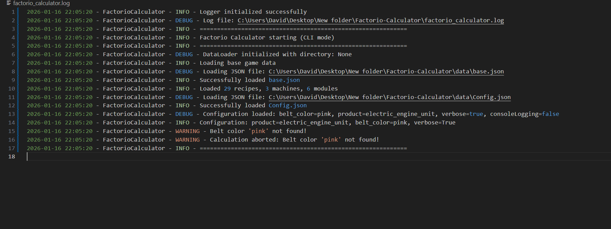

**Observations:**
- Error message displayed: "Belt color 'pink' not found!"
- No calculation tree file created
- Program exits gracefully (no crash)
- Error logged in log file


---

## Test Case 4: CLI - Corrupted Config Handling

**Status:** ✅ PASS / ❌ FAIL

**Description:**
Test error handling when Config.json contains invalid JSON syntax.

**Configuration Used:**
Invalid JSON (removed final `}`)

**Screenshots:**
- Console Error Message:
  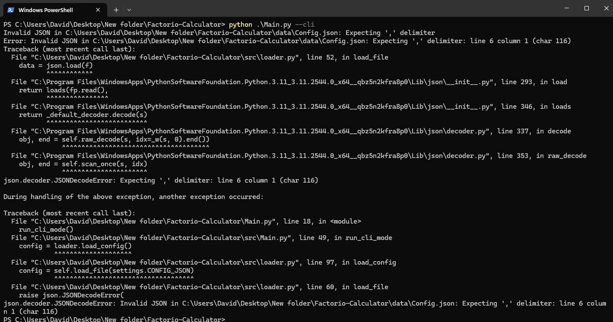
- Log File showing JSON error:
  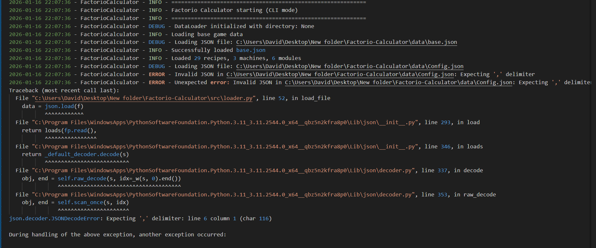

**Observations:**
- Clear JSON error shown in log file
- No crash loop or silent failure
- Config.json restored after test


---

## Test Case 5: Wizard - Launch and Calculate

**Status:** ✅ PASS

**Description:**
Test the Textual wizard UI to launch, select a recipe, and perform a calculation.

**Steps Performed:**
1. Launched wizard with `python .\Main.py`
2. Expanded a category and selected "Iron Gear Wheel" (or other recipe)
3. Selected green belt (default)
4. Left Verbose unchecked
5. Clicked Calculate

**Screenshots:**
- Wizard UI Initial State:
  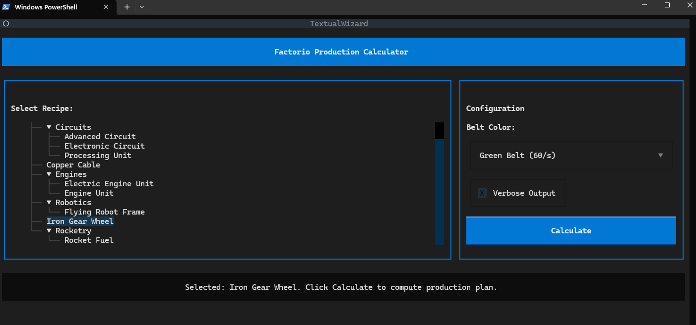
- Output File Generated:
  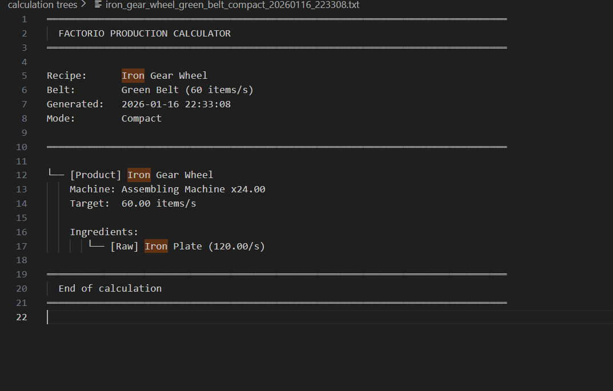

**Observations:**
- UI loads without errors
- Category expansion works
- Recipe selection works
- Belt color selection works
- Calculate button executes successfully
- Output file created in `calculation trees/`
- No errors or logical mistakes


---

## Test Case 6: Wizard - Verbose Toggle

**Status:** ✅ PASS 

**Description:**
Test that the Verbose Output toggle changes the detail level of output files.

**Steps Performed:**
1. Run 1: Selected recipe with Verbose Output checked → Calculate
2. Run 2: Selected same recipe with Verbose Output unchecked → Calculate
3. Compared the two output files

**Screenshots:**
- Wizard with Verbose Unchecked:
  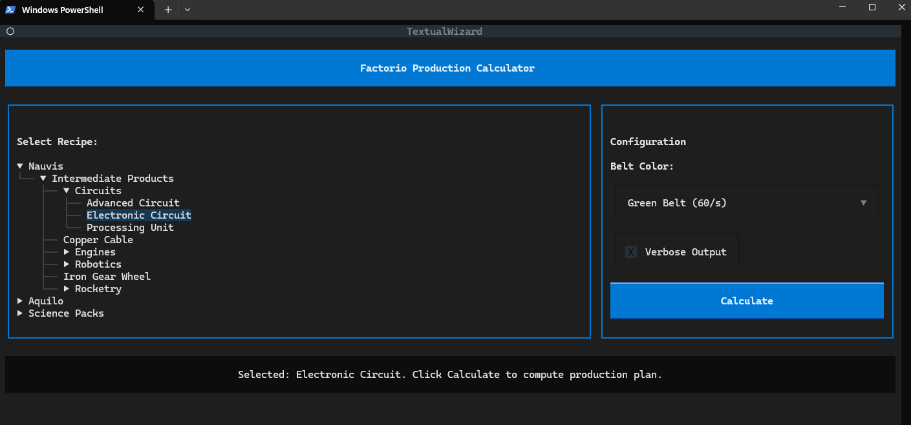
- Wizard with Verbose Checked:
  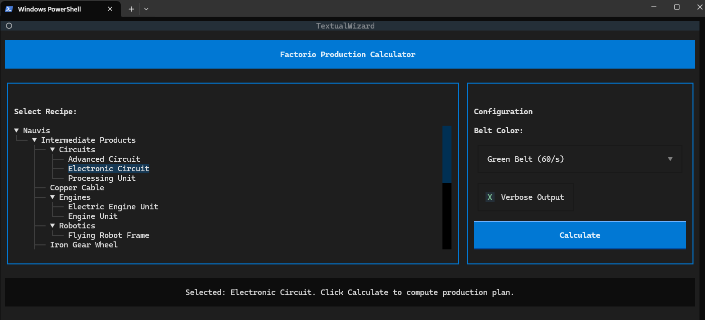
- Compact Output File Content:
  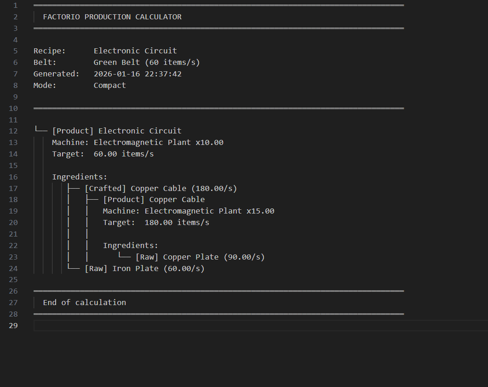
- Verbose Output File Content:
  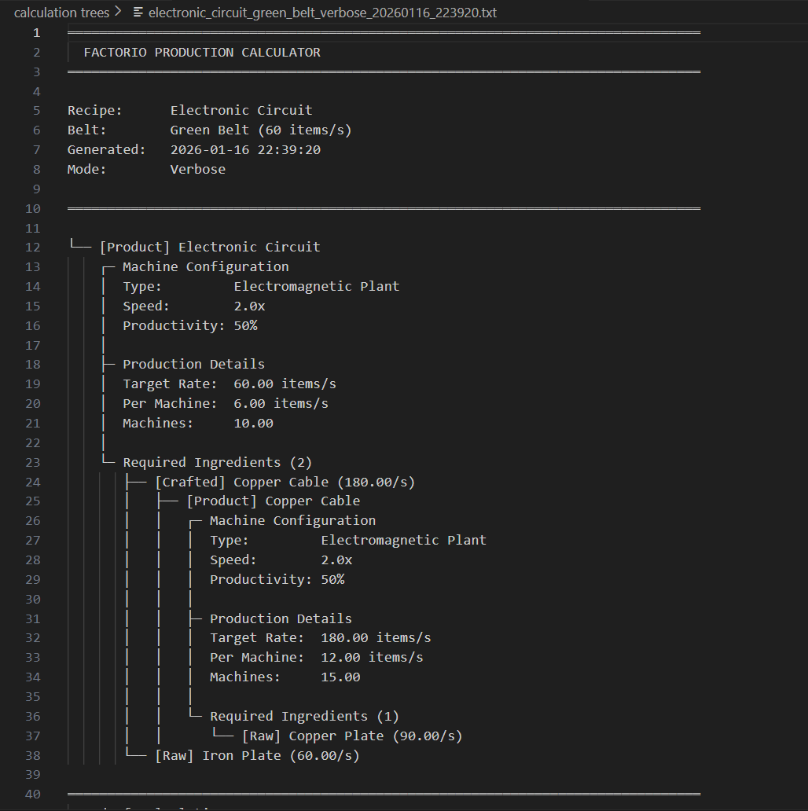

**Observations:**
- Verbose checkbox toggles successfully
- Verbose file includes machine speed/productivity details
- Compact file excludes machine speed/productivity details
- Both files valid and correctly named
- Both files saved in correct location


---

## Test Case 7: Wizard - No Recipe Selected Error

**Status:** ✅ PASS

**Description:**
Test error handling when attempting to calculate without selecting a recipe.

**Steps Performed:**
1. Launched wizard
2. Did not select any recipe
3. Clicked Calculate

**Screenshots:**
- Error Message Displayed:
  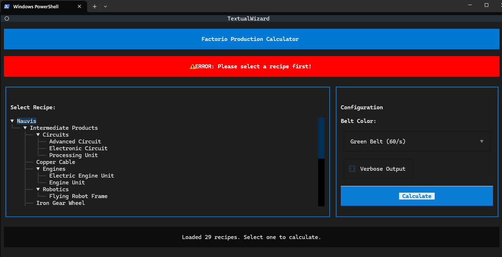
- Logger Output (if visible):
  

**Observations:**
- Error message displayed: "ERROR: Please select a recipe first!"
- Logger shows WARNING level entry
- Application remains running (no crash)
- User can retry the calculation
---
